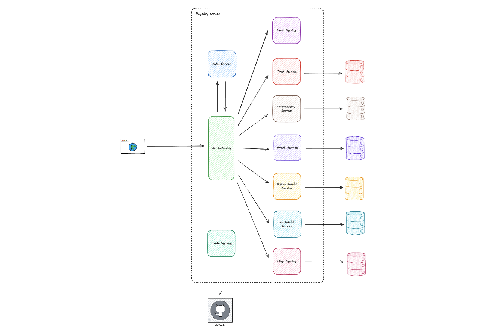
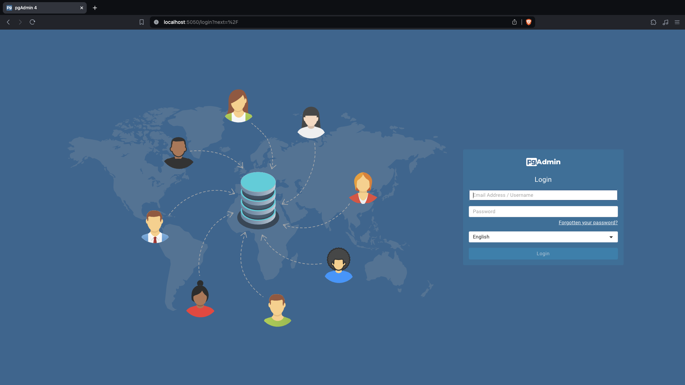
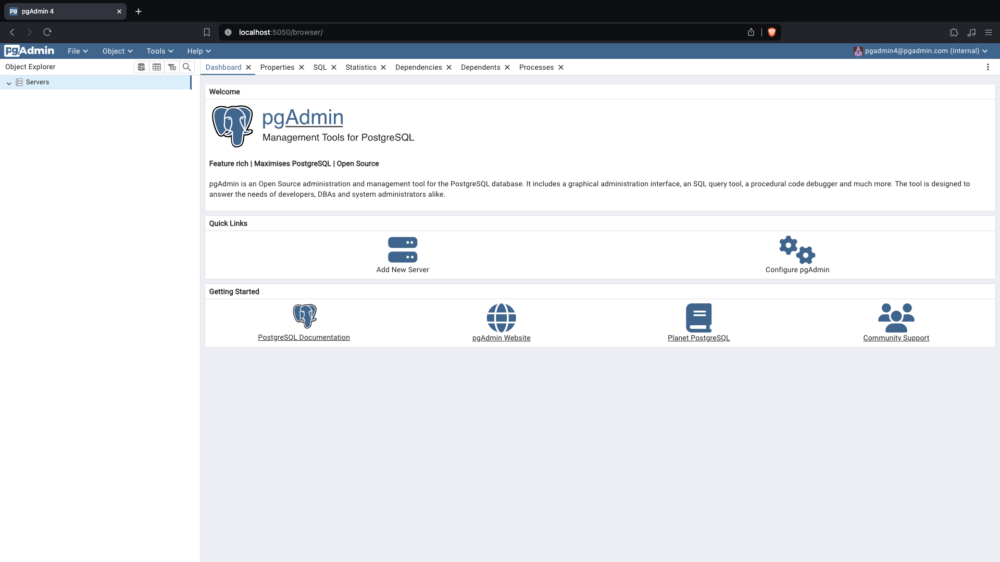
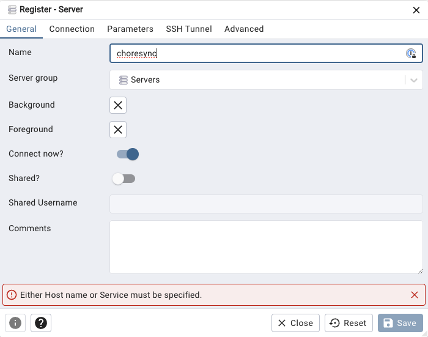
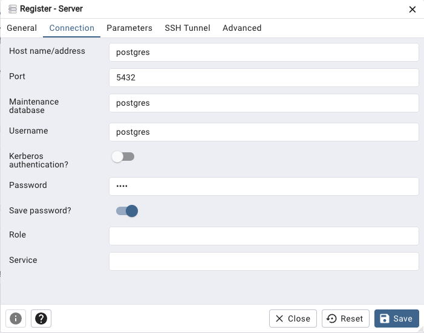

# 📌 ChoreShare


## 📖 Table of Contents

- [📝 Contributors](#📝-contributors)
- [📜 Description](#📜-description)
- [📚 Tech Stack](#📚-tech-stack)
- [🧩 Architecture Overview](#🧩-architecture-overview)
- [📱 Frontend Documentation](#📱-frontend-documentation)
- [🚀 Backend Documentation](#🚀-backend-documentation)
  - [Database Setup](#database-setup)
  - [Running the Backend](#running-the-backend)

## 📝 Contributors

- Axel Sanchez
- Mariia Podgaietska
- Jayden Mikulcik
- Ryan Lau
- Evan Cherewko
- Alex On
- Rhishik Roy

## 📜 Description

Roommate task board application. Many roommates living together can add and remove tasks to a shared board. This will help organize chores and tasks within a shared space and increase the quality of life within shared living situations.

## 📚 Tech Stack

- Mobile


- Frontend


- Backend


- Database


- DevOps


## 🧩 Architecture Overview



## 📱 Frontend Documentation

Coming soon...

## 🚀 Backend Documentation

### Running the Backend

1. Open the terminal and clone this repository using HTTPS or SSH (The example below uses SSH).

```bash
git clone git@github.com:Axeloooo/ChoreShare.git
```

2. `cd` into the `ChoreShare` directory.

```bash
cd ChoreShare
```

3. Open a new terminal and from the root directory of the repository, `cd` into the `backend` directory.

```bash
cd backend
```

4. Run the following command to start the backend.

```bash
docker compose up -d
```

5. Open the browser and navigate to `http://localhost:8761` to view the Eureka dashboard.

6. Open the browser and navigate to `http://localhost:5050` to view the PG4Admin dashboard.

## Setup PG4Admin

1. Make sure you followed the steps on [Running the Backend](#running-the-backend) before proceeding.

2. Open the browser and navigate to `http://localhost:5050` to view the PG4Admin dashboard.

3. Login with the following credentials:

- **Username:** `pgadmin4@pgadmin.com`

- **Password:** `admin`



4. Click on `Add New Server`.



5. In the `General` tab, enter the following information:

- **Name:** `ChoreShare`



6. In the `Connection` tab, enter the following information:

- **Host name/address:** `postgres`

- **Port:** `5432`

- **Maintenance database:** `postgres`

- **Username:** `postgres`

- **Password:** `root`

- **Save password?:** `Yes`


