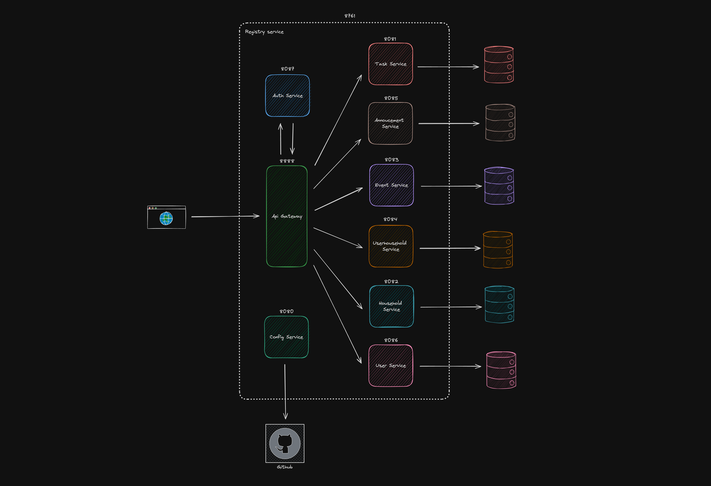

# 🛎️ ChoreSync: Roommate Task Coordinator

## 📖 Table of Contents

- [📝 Contributors](#📝-contributors)
- [📜 Description](#📜-description)
- [📚 Tech Stack](#📚-tech-stack)
- [🧩 Architecture Overview](#🧩-architecture-overview)
- [📱 Frontend Documentation](#📱-frontend-documentation)
- [🚀 Backend Documentation](#🚀-backend-documentation)

## 📝 Contributors

- Mariia Podgaietska
- Jayden Mikulcik
- Ryan Lau
- Axel Sanchez
- Evan Cherewko
- Alex On
- Rhishik Roy

## 📜 Description

Roommate task board application. Many roommates living together can add and remove tasks to a shared board. This will help organize chores and tasks within a shared space and increase the quality of life within shared living situations.

## 📚 Tech Stack

- Frontend

- Backend

- Database

- DevOps

## 🧩 Architecture Overview

## 📱 Frontend Documentation

Coming soon...

## 🚀 Backend Documentation

Coming soon...
